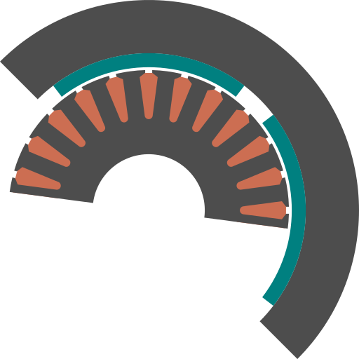

# 3F --- Framework For Femm

Some drawing and analysis code through FEMM 3.3

The icon is temporary due to copyright restrictions.

2016/08/23

## How-to quickly:
1. make a copy of the folder `template_motor` in `./`
2. rename it to your taste
3. edit `motor_data.lua` with your specifications
4. add, change, remove (carefully) materials in `materials_and_bc.lua`
5. double-click on `3Flin{.desktop}` shortcut (Linux) or `3Fwin{.lnk}` (Windows) [you can also look at the one which *displays the icon*]

## Requirements:
If you're using Linux you have to install Wine and configure FEMM
in `3F/femm33Mar`.

## What if:

### I already have a `.FEM` drawing

Fine, after step 2 read `yourfolder/README.txt` and follow the instructions.

### I just want to make the drawing

After step 4 modify the variable `TYPE` inside `yourfolder/type.sh`
and just put `"DRAWING"`. Continue with step 5.
Wait for it and look for the file `yourfolder/yourfile.fem`

### After some modifications to the drawing, I want to analise this machine

After step 4 modify the variable `TYPE` inside `yourfolder/type.sh`
and just put `"ANALYSIS"`. Continue with step 5.
Wait for it and look for the output file inside `yourfolder/output/`

### Now I'd like to simulate other things/settings

Make your choices in `yourfolder/motor_data.lua`. You can find a record
of all the results in `yourfolder/output/`, sorted by the `date_time` of
launch.

[//]: # (### I'm on Windows)

[//]: # (Don't worry, a pretty handy shortcut is coming for Windows too!)

### I had a problem during the analysis

Try to look at `3F/log/analysis_date_time.log` and see where it stopped.
Then have a look at `3F/temp.fem` to see the last motor analysed.

### I'd like to know what all the options in `motor_data.lua` means

See `3F/doc/main.pdf` for some of those options.

### I don't understand why you made easy things complex

Generality. A unique framework for the analysis of rotating electrical machines through FEMM.
Reuse of code. Easy link to optimiser (I hope).

## What's next

1. I have to complete the set of possible analyses.
2. introduce the number of conductor in slots
3. some small bugs (like air-gap closing) must be fixed.
4. other synchronous machines have to be implemented, building under
   `3F/drawing/rotor.lua` (IPM radial, IPM tangential, RELuctance, PMAREL)
5. other slot shapes can be drawn (closed slot, deep bars), so extending
   the capabilities of `3F/drawing/fun_draw_slot.lua`
6. other analysis types must be created for the Induction Motor (IM),
   even though the common ground for its drawing is already here
   (apart from point 5 of course)
